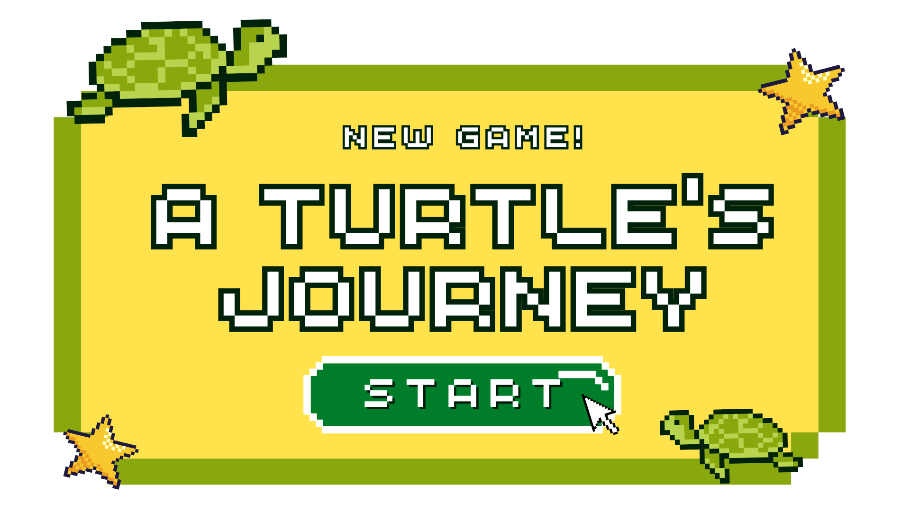

    

# A Turtle's Journey 🐢

## Project Description
- This project, aligned with SDG 14 (Life Below Water), is a console-based adventure game where players guide a young turtle through the ocean, encountering marine biodiversity and overcoming environmental hazards. Key features include challenges related to pollution, predators, and climate impacts on marine life. The game aims to educate players on the importance of preserving marine ecosystems while fostering an understanding of ocean health and conservation. Lastly, this project encourages awareness and empathy toward marine life and the environment in a fun and engaging way.