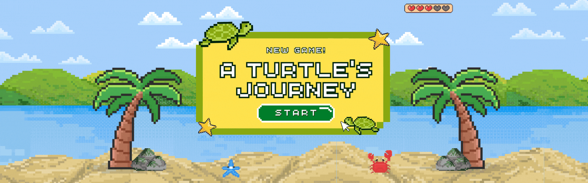
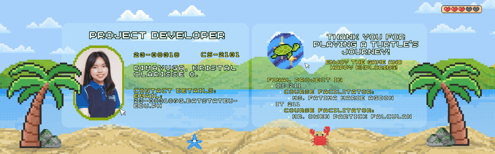

<p align="center">
    
</p>

# A Turtle's Journey 🐢
*An adventure to protect marine life and learn about the wonders of the ocean!*

## Contents
- [Project Overview](#-project-overview)
  - [Objectives](#-objectives)
  - [Sustainable Development Goals (SDGs)](#-sustainable-development-goals-sdgs)
    - [SDG Application](#sdg-application)
- [Project Development](#-project-development)
  - [Technical Solution Framework](#-technical-solution-framework)
  - [Usage Guidelines](#-usage-guidelines)
  - [Project Deliverables & Main Components](#-project-deliverables--main-components)
  - [Classes](#-classes)
- [Object-Oriented Programming Application Principles](#-oop-application-principles)
  - [Encapsulation](#1-encapsulation)
  - [Inheritance](#2-inheritance)
  - [Polymorphism](#3-polymorphism)
  - [Abstraction](#4-abstraction)
- [CRUD Operations Applications](#-crud-operations-applications)
  - [Create](#1-create)
  - [Read](#2-read)
  - [Update](#3-update)
  - [Delete](#4-delete)
- [Project Developer](#-project-developer)

---

## 📜 Project Overview
**A Turtle's Journey** is a Java-based console game that follows the adventures of a young green sea turtle striving to reach the Bahamas. Inspired by the heartwarming story of the 2010 film *A Turtle’s Tale: Sammy’s Adventures*, the game combines educational challenges, mini-games, and marine exploration to promote **marine life conservation** and raise awareness about **ocean health**.

This project supports **Sustainable Development Goals**:
- **SDG 4: Quality Education** 📖
- **SDG 14: Life Below Water** 🌊🐠
- **SDG 17: Partnerships for the Goals** 🤝

Through interactive chapters and educational quizzes, players not only explore vibrant marine ecosystems but also learn about the real-world challenges facing our oceans today.

---

## 🎯 Objectives
- Educate players on marine biodiversity and conservation.
- Raise awareness of real-world issues like pollution and ocean hazards.
- Provide informational content to the different marine animals and marine locations.
- Provide entertainment to anyone who wanted to learn and have fun.
- Align with the United Nations' Sustainable Development Goals (SDGs).

---

## 🌍 Sustainable Development Goals (SDGs)
The game addresses the following SDGs:

| Sustainable Development Goals (SDG) | Significance                                                                 |
|-------------------------------------|-----------------------------------------------------------------------------|
| **SDG 4: Quality Education**        | Promotes awareness through interactive learning and informative quizzes.    |
| **SDG 14: Life Below Water**        | Highlights marine conservation and addresses ocean pollution challenges.    |
| **SDG 17: Partnerships for the Goals** | Encourages collaboration for global environmental advocacy.                 |
---

## 💻 Project Development


## 🛠️ Technical Solution Framework

**A Turtle's Journey is built With:**
- **Java (OOP)** 🐍 - Object-Oriented Programming for modular and clean code.
- **IntelliJ IDE** 💻 - Development environment for coding and debugging.
- **MySQL Database** 🗄️ - Stores game data like character profiles, locations, and quizzes.

---

## **📖 Usage Guidelines**
1. **Start Your Adventure** - Launch the game, create an account, and get your unique `player_id`.
2. **Explore the Ocean** - Interact with marine characters like Jake the loggerhead turtle and Oscar the octopus.
3. **Solve & Progress** - Complete quizzes, mini-games, and challenges to unlock new chapters.
4. **Save & Track** - Save your progress and continue your journey anytime.
5. **Learn & Enjoy** - Immerse yourself in the underwater world while gaining insights into ocean conservation.

## **📦 Project Deliverables & Main Components**
- **Interactive Storyline**: A five-chapter adventure with engaging characters, challenges, and 20+ minutes of gameplay.
- **Educational Mini-Games**: Trivia, quizzes, and challenges that promote learning about marine life.
- **Database Integration**: Efficient storage of player data, character profiles, and progress in the `TurtleOceanJourney` database.
- **Save/Load System**: Seamless tracking and resumption of player progress.
- **Game Flow Control**: Manages story progression, mini-games, and interactions.
- **Immersive Console UI**: Retro-style typed text effects and visually engaging menus.
---

## 📌 Classes

| No | Class Name                | Purpose                                                           |
|----|---------------------------|-------------------------------------------------------------------|
| 1  | **MainMenu**              | Entry point of the game.                                          |
| 2  | **Game**                  | Controls game initialization and flow.                            |
| 3  | **GameFlowControl**       | Manages progression between chapters.                             |
| 4  | **DatabaseConnection**    | Connects to the MySQL database.                                   |
| 5  | **Progress**              | Tracks player progress and saves game state.                      |
| 6  | **Chapter1 - Chapter5**   | Represents each game chapter with unique interactions.            |
| 7  | **Turtle**                | Main character class with attributes like health, name, and age.  |
| 8  | **MarineLife**            | Represents marine creatures with their assigned trivia and facts. |
| 9  | **EdibleOrNotGame**       | Implements the edible-or-not mini-game.                           |
| 10 | **Quiz**                  | Manages educational quiz questions and scoring.                   |

---

## 📂 File Structure
```
src
├── Main.java
├── chapter
│   ├── Chapter.java
│   ├── Chapter1.java
│   ├── Chapter2.java
│   ├── Chapter3.java
│   ├── Chapter4.java
│   └── Chapter5.java
├── controllers
│   ├── Game.java
│   └── GameFlowControl.java
├── db
│   ├── DatabaseConnection.java
│   └── Progress.java
├── events
│   ├── EdibleOrNotGame.java
│   └── Quiz.java
├── menu
│   └── MainMenu.java
├── models
│   ├── Environment.java
│   ├── MarineLife.java
│   ├── Obstacle.java
│   └── Turtle.java
└── utility
    └── Utility.java

```


---

##  ⚙️ OOP Application Principles
This project demonstrates **Object-Oriented Programming (OOP)** principles in various components of the game. Below are examples showcasing each principle with relevant **code snippets** directly from the project.

---

### **1. Encapsulation**
Encapsulation ensures data security by restricting direct access to object attributes and exposing only necessary details via **getters** and **setters**.

**Example: `Turtle` Class (Private Attributes and Public Methods)**  
The `Turtle` class has private attributes such as `name`, `age`, and `health`, accessed or modified through public getter and setter methods.

```java
private String name; // Turtle's name
private int age;
private int health;

// Getters and Setters
public int getHealth() {
    return health;
}

public void setHealth(int health) {
    this.health = health; // Controlled access to health attribute
}

public int getAge() {
    return age;
}

public String getName() {
    return name;
}

public void setName(String name) {
    this.name = name; // Securely updating name
}
```

**Usage in `Chapter1`:**
```java
Turtle turtle = new Turtle(playerId);
turtle.setName(turtleName); // Using setter to assign turtle's name
```

---

### **2. Inheritance**
Inheritance allows a class to inherit attributes and behaviors from a parent (super) class. In this project, **`Chapter`** serves as a base class for all chapters, and **`Chapter1`** inherits from it.

**Example: Abstract `Chapter` Class and `Chapter1` Subclass**

**`Chapter` (Parent Class):**
```java
public abstract class Chapter {
    protected int playerId;

    public Chapter(int playerId) {
        this.playerId = playerId;
    }

    public abstract void start(); // Abstract method ensures each chapter defines its logic
}
```

**`Chapter1` (Child Class):**
```java
public class Chapter1 extends Chapter {
    public Chapter1(int playerId) {
        super(playerId); // Call to parent class constructor
    }

    @Override
    public void start() {
        System.out.println("Chapter 1 begins...");
        // Chapter-specific implementation here
    }
}
```

---

### **3. Polymorphism**
Polymorphism allows methods to behave differently based on the object calling them, providing flexibility and reusability.

**Example: Overriding Methods in `Chapter1`**  
The `start()` method in the `Chapter` class is abstract and must be implemented in subclasses like `Chapter1`.

**In `Chapter1`:**
```java
@Override
public void start() {
    Utility.typeWriter("Chapter 1: Birth and Survival", 30);
    // Chapter-specific implementation for player actions
}
```

**Another Example: Turtle's `ageUp` Method**  
The behavior of aging can be generalized but is specific to the `Turtle` class.

```java
public void ageUp(int points) {
    age += points;
    Utility.typeWriter(name + " ages up and is now " + age + " years old.", 30);
}
```

---

### **4. Abstraction**
Abstraction simplifies complex systems by defining a **common blueprint** through abstract classes. It enforces a consistent structure across implementations while hiding unnecessary details.

**Example: Abstract `Chapter` Class**  
The `Chapter` class defines a structure that all chapters must follow, using an abstract method `start()`.

```java
public abstract class Chapter {
    protected int playerId;

    public Chapter(int playerId) {
        this.playerId = playerId;
    }

    public abstract void start(); // Abstract method
}
```

**Implemented in `Chapter1`:**
```java
public class Chapter1 extends Chapter {
    public Chapter1(int playerId) {
        super(playerId);
    }

    @Override
    public void start() {
        System.out.println("Starting Chapter 1...");
        // Chapter-specific implementation here
    }
}
```

---

## 📃 CRUD Operations Applications
### **1. Create**
The Create operation is used when initializing new game data or inserting new player information into the database.

**Example:**
```java
PreparedStatement stmt = conn.prepareStatement(
    "INSERT INTO Players (username) VALUES (?)",
    PreparedStatement.RETURN_GENERATED_KEYS
);
stmt.setString(1, username);
stmt.executeUpdate();
```
- **Purpose:** When starting a new game, this code adds a new player to the `Players` table and generates a unique `player_id`.
- **Related Class/Method:** `newGame()` method in `MainMenu`.

### **2. Read**
The Read operation is used to fetch data from the database, such as retrieving saved progress, loading player information, or displaying chapter details.

**Example:**
```java
PreparedStatement stmt = conn.prepareStatement(
    "SELECT * FROM Players WHERE player_id = ?"
);
stmt.setInt(1, playerId);
ResultSet rs = stmt.executeQuery();
```
- **Purpose:** Reads player information to validate their existence or fetch data about their progress.
```java
MarineLife julia = new MarineLife(null, null, null, null, null, null, null);
julia.getCharacterInfo(6); // Reads data from the database
julia.displayCharacterInfo(); // Displays the fetched data
```
- **Purpose:** Retrieves information about specific marine life characters from the database and displays it to the console.
- **Related Class/Method:** Methods like `getCharacterInfo()` in the `MarineLife` class and queries in `loadGame()`.

### **3. Update**
The Update operation is used to modify existing data in the database, such as updating the player's progress or game state.
**Example:**
```java
PreparedStatement stmt = conn.prepareStatement(
    "UPDATE Progress SET chapter = ?, progress_state = ? WHERE player_id = ?"
);
stmt.setInt(1, nextChapter);
stmt.setString(2, "In Progress");
stmt.setInt(3, playerId);
stmt.executeUpdate();
```
- **Purpose:** Updates the player's current chapter and progress state in the `Progress` table after completing a chapter or significant game event.
- **Related Class/Method:** Methods in `GameFlowControl` or chapter transition logic.

### **4. Delete**
The Delete operation is used to remove player data from the database, such as resetting progress or deleting player accounts.
**Example:**
```java
PreparedStatement deleteProgressStmt = conn.prepareStatement(
    "DELETE FROM Progress WHERE player_id = ?"
);
deleteProgressStmt.setInt(1, playerId);
deleteProgressStmt.executeUpdate();
```
```java
PreparedStatement deletePlayerStmt = conn.prepareStatement(
        "DELETE FROM Players WHERE player_id = ?"
);
deletePlayerStmt.setInt(1, playerId);
deletePlayerStmt.executeUpdate();
```
- **Purpose:** Removes all associated data for a specific player, including their progress and personal details, when they choose to reset the game.
- **Related Class/Method:** `deleteProgress()` in `MainMenu`.

---
### 🧑‍💻 Project Developer
<p align="center">
    
</p>
